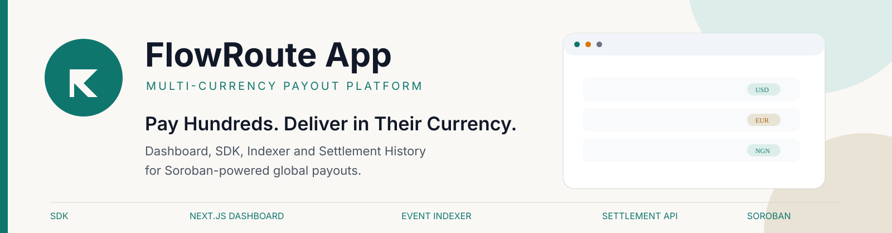

# flowroute-app

flowroute-app is the application layer for FlowRoute, a payout tool for businesses that need to send money to many people at once, where each recipient may want a different currency. This repo holds a typed SDK for the FlowRoute contract, a Next.js payout dashboard, and an event indexer with a read API. It calls the on-chain contract that swaps assets through Soroswap, enforces the per-recipient minimum received, and records auditable settlement events. The Soroban contract itself lives in the sibling repo, flowroute-contract.

**Documentation:** https://hollujay-labs.gitbook.io/flowroute/

## Live deployment

Web app: https://flowroute-app.vercel.app

Indexer API: https://flowroute-app.onrender.com (health check at `/health`)

Both the web app and the indexer, including the worker that ingests new on-chain events, are live and running on free hosting tiers.

## Structure

This is a pnpm workspace with three packages:

- `packages/sdk` (`@stellar-flowroute/sdk`): typed client for the FlowRoute contract. Wraps contract invocation, transaction building, and Soroban RPC access. Both `apps/web` and `indexer` depend on it.
- `apps/web` (`@stellar-flowroute/web`): Next.js dashboard for building and running payout batches, and for viewing settlement history. Talks to the FlowRoute contract directly through the SDK and Freighter, and reads settlement history from the indexer's API.
- `indexer` (`@stellar-flowroute/indexer`): an ingestion worker that follows FlowRoute contract events into Postgres, plus a read API (Hono) that serves that data to `apps/web`.

The on-chain contract itself lives in the sibling repository [flowroute-contract](https://github.com/Stellar-flowroute/flowroute-contract). This repo consumes that contract's ABI through `packages/sdk`; it does not contain any contract source.

## Quick Start

1. Install dependencies from the repo root:

   ```
   pnpm install
   ```

2. Set up environment files. Each package has an `.env.example` describing what it needs:

   ```
   cp packages/sdk/.env.example packages/sdk/.env.local
   cp indexer/.env.example indexer/.env.local
   cp apps/web/.env.example apps/web/.env.local
   ```

   Fill in `FLOWROUTE_CONTRACT_ID` / `NEXT_PUBLIC_FLOWROUTE_CONTRACT_ID` with the testnet contract address from [Contract addresses](#contract-addresses) below, and `DATABASE_URL` in `indexer/.env.local` with your local Postgres connection string.

3. Start Postgres (any local instance works, for example via your system package manager or Docker):

   ```
   docker run -d --name flowroute-postgres -e POSTGRES_PASSWORD=password -e POSTGRES_USER=user -e POSTGRES_DB=flowroute -p 5432:5432 postgres:16
   ```

4. Start the indexer worker. It applies `indexer/src/schema.sql` on startup, so no separate migration step is needed:

   ```
   pnpm --filter @stellar-flowroute/indexer dev
   ```

5. Start the indexer's read API, in a separate terminal:

   ```
   pnpm --filter @stellar-flowroute/indexer dev:api
   ```

6. Start the web app, in a separate terminal:

   ```
   pnpm --filter @stellar-flowroute/web dev
   ```

## The FLOWROUTE_USE_CURL_FETCH flag

On some machines, Node's built-in `fetch` fails to reach `soroban-testnet.stellar.org` with a connection timeout, even though `curl` reaches the same host from the same machine without issue. This appears to be a narrow Node networking incompatibility with that specific endpoint, not a real DNS or network problem.

To work around it locally, `packages/sdk` includes an opt-in fetch override that shells out to `curl` for RPC requests. It is off by default. Enable it only if you hit this issue:

```
FLOWROUTE_USE_CURL_FETCH=1 pnpm --filter @stellar-flowroute/indexer dev
```

This should not be necessary in a normal hosted environment.

## Contract addresses

Testnet:

| Contract | Address |
| --- | --- |
| FlowRoute Router | `CBDWWJOW25KPUID432RZXFIPLHRYZY5KIXBT7FMC2L6LHFOITBMUX5LE` |
| Soroswap Router (called by FlowRoute) | `CCJUD55AG6W5HAI5LRVNKAE5WDP5XGZBUDS5WNTIVDU7O264UZZE7BRD` |

## Contributing

See [CONTRIBUTING.md](CONTRIBUTING.md) for workspace setup, the git workflow, and how to open a pull request.

## Maintainers

| Name | Contact |
| --- | --- |
| Hollujay | [@Hollujay](https://github.com/Hollujay) |
